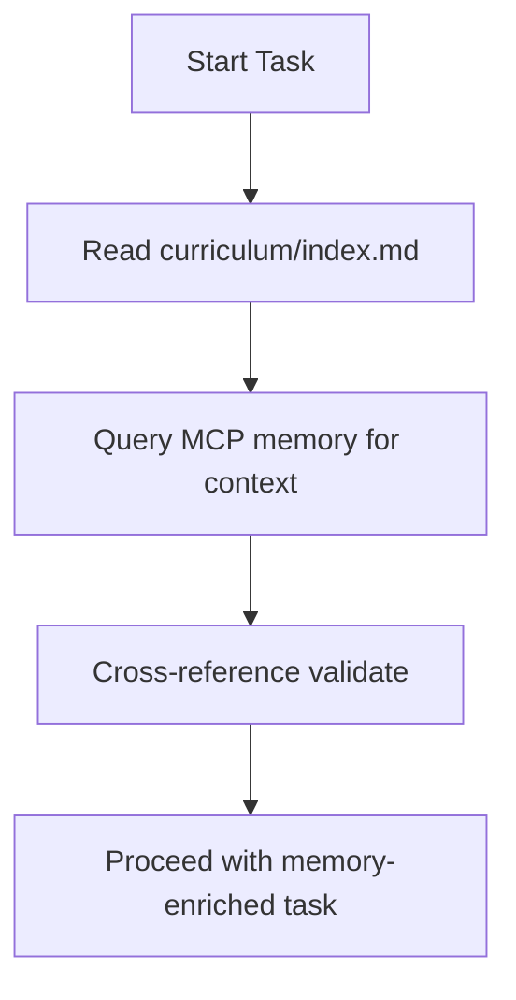
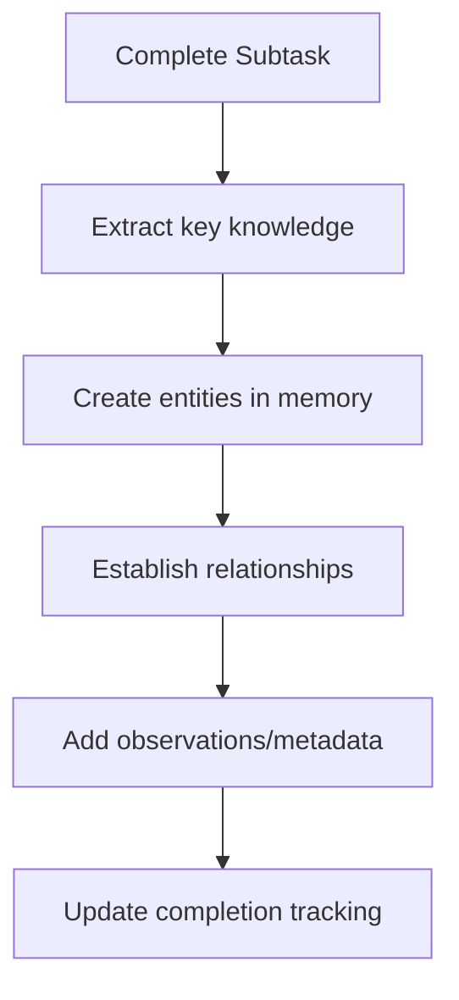
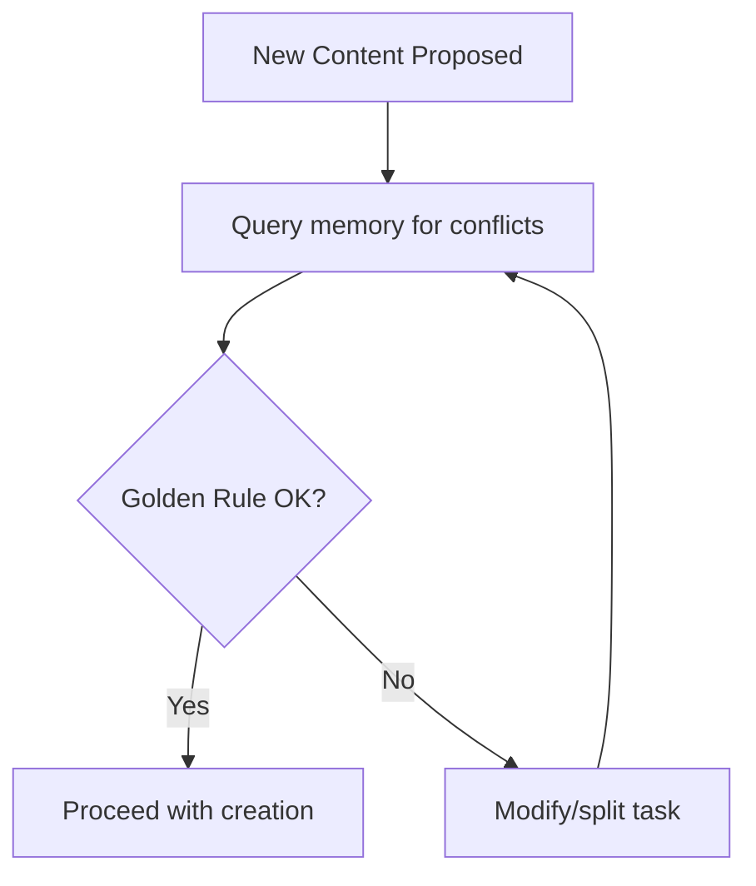

# MCP Memory Integration Rules

## Overview

The MCP Memory Server provides structured knowledge storage and retrieval capabilities that enhance curriculum consistency, layering, and progress tracking. This document defines when and how to use MCP memory tools to improve the MTM curriculum creation workflow.

## MCP Memory Tools Available

### Core Memory Operations
- **`read_graph`**: Read the entire knowledge graph for comprehensive context
- **`search_nodes`**: Search for specific entities using queries (vocabulary, grammar, modules)
- **`open_nodes`**: Access specific entities by name for detailed information
- **`create_entities`**: Create new knowledge entities (vocabulary, grammar, concepts)
- **`create_relations`**: Establish relationships between entities (vocabulary to grammar, modules to concepts)
- **`add_observations`**: Add detailed information to existing entities
- **`delete_entities`/`delete_relations`/`delete_observations`**: Remove outdated or incorrect knowledge

## When to Use MCP Memory (CRITICAL DECISION POINTS)

### 1. MTM Orchestrator - Strategic Memory Usage

#### A. Context Retrieval (MANDATORY)
**USE WHEN**: Starting any curriculum work or lesson delegation
- **QUERY**: `read_graph` to get complete knowledge state
- **QUERY**: `search_nodes` with "completed vocabulary [Module Range]" for layering context
- **QUERY**: `open_nodes` with specific module names for detailed progress
- **BENEFIT**: Instant structured data vs. slow file parsing

#### B. Golden Rule Verification (CRITICAL)
**USE WHEN**: Before delegating any lesson creation task
- **QUERY**: `search_nodes` for existing vocabulary in target module
- **QUERY**: `search_nodes` for grammar structures already taught
- **VERIFICATION**: Ensure only ONE new concept (vocabulary OR grammar) per lesson
- **ACTION**: Split into separate subtasks if Golden Rule violated

#### C. Progress Tracking (MANDATORY)
**USE WHEN**: After completing any module or lesson
- **ACTION**: `create_entities` for new vocabulary introduced
- **ACTION**: `create_relations` linking concepts to modules
- **ACTION**: `add_observations` with completion dates and statistics
- **BENEFIT**: Persistent progress tracking beyond file system

### 2. MTM Lesson Creator - Content Memory Usage

#### A. Mnemonic Management (CRITICAL)
**USE WHEN**: Creating new vocabulary with mnemonics
- **QUERY**: `search_nodes` for existing mnemonic patterns
- **ACTION**: `create_entities` for new vocabulary with mnemonic data
- **STORAGE**: Include acoustic links, vivid imagery, sound-alike bridges
- **BENEFIT**: Prevents conflicting mnemonics across modules

#### B. Consistency Validation (MANDATORY)
**USE WHEN**: Starting any lesson creation
- **QUERY**: `search_nodes` for previously taught vocabulary in target language
- **QUERY**: `search_nodes` for established grammar patterns
- **VERIFICATION**: Ensure new content builds on existing knowledge
- **ACTION**: Layer old elements in new contexts

#### C. Quality Standards (MANDATORY)
**USE WHEN**: Validating lesson completeness
- **QUERY**: `search_nodes` for lesson-specific validation criteria
- **STORAGE**: `add_observations` with quality metrics and validation results
- **BENEFIT**: Continuous improvement of lesson quality

### 3. Curriculum Builder - Structural Memory Usage

#### A. Template Storage (MANDATORY)
**USE WHEN**: Creating successful curriculum structures
- **ACTION**: `create_entities` for effective module patterns
- **ACTION**: `create_relations` linking structures to learning outcomes
- **BENEFIT**: Reusable templates for future curricula

#### B. Path Management (CRITICAL)
**USE WHEN**: Establishing new curriculum paths
- **QUERY**: `search_nodes` for existing path patterns
- **ACTION**: `create_entities` for new curriculum paths with metadata
- **VERIFICATION**: Prevent duplicate or conflicting structures

## MCP Memory Usage Patterns

### Pattern 1: "Context First" Approach


### Pattern 2: "Store Everything" Approach


### Pattern 3: "Verify Against Memory" Approach


## Query Templates (READY TO USE)

### Vocabulary Layering Queries
- `"completed vocabulary modules 1-5 [target language]"`
- `"mnemonic patterns for [concept type]"`
- `"vocabulary similar to [new word] pronunciation"`

### Grammar Structure Queries
- `"grammar structures taught before [module number]"`
- `"sentence patterns using [grammatical concept]"`
- `"advanced applications of [basic grammar point]"`

### Progress Tracking Queries
- `"module [number] completion status"`
- `"lesson creation patterns for [topic]"`
- `"quality metrics for [lesson type]"`

## Entity Naming Conventions

### Vocabulary Entities
- Format: `[Word]_[Language]_Vocabulary`
- Example: `hello_korean_vocabulary`
- Example: `water_mandarin_vocabulary`

### Grammar Entities
- Format: `[Concept]_[Language]_Grammar`
- Example: `present_tense_korean_grammar`
- Example: `question_formation_mandarin_grammar`

### Module Entities
- Format: `Module[XX]_[Curriculum]`
- Example: `Module01_english-to-korean`
- Example: `Module03_english-to-mandarin`

## Relationship Types

### Standard Relationships
- `builds_on`: Content builds on previously taught concept
- `introduces`: Module or lesson introduces new concept
- `reinforces`: Content reinforces previously learned material
- `applies`: Practical application of theoretical concept
- `relates_to`: General relationship between concepts

### Example Relationship Creation
```javascript
// New vocabulary builds on existing grammar
create_relations([
  {
    from: "hello_korean_vocabulary",
    to: "basic_greetings_korean_grammar",
    relationType: "builds_on"
  }
])
```

## Data Quality Standards

### Required Entity Fields
- **name**: Standardized naming convention
- **entityType**: Vocabulary, Grammar, Module, Mnemonic, etc.
- **observations**: Array of detailed descriptions and metadata

### Required Observation Content
- **pronunciation**: For vocabulary entities
- **meaning**: Clear definition and usage context
- **mnemonic**: Memory aid with vivid imagery
- **examples**: Practical usage examples
- **cultural_notes**: Cultural context where relevant

## Error Prevention Rules

### Cross-Reference Validation (MANDATORY)
- Always validate MCP memory data against curriculum index file
- Resolve discrepancies before proceeding with any task
- Memory should supplement, not replace, file-based truth

### Duplicate Prevention (MANDATORY)
- Search for existing entities before creating new ones
- Use `search_nodes` with variations of entity names
- Merge similar entities rather than creating duplicates

### Consistency Maintenance (MANDATORY)
- Use standardized naming conventions
- Maintain consistent relationship types
- Regular validation of memory graph integrity

## Performance Considerations

### Efficient Query Patterns
- Use specific queries rather than reading entire graph
- Cache frequently accessed data in working memory
- Batch multiple operations when possible

### Memory Management
- Regular cleanup of outdated entities
- Archive completed curricula to prevent graph bloat
- Use observations for metadata rather than separate entities

## Integration Checklist

Before completing any task, verify:

- [ ] **Memory queried** for relevant context before starting
- [ ] **New knowledge stored** in appropriate entities
- [ ] **Relationships established** between related concepts
- [ ] **Cross-reference validated** against file-based sources
- [ ] **Naming conventions followed** consistently
- [ ] **Quality standards met** for all stored data
- [ ] **Progress updated** in memory tracking entities

**FORBIDDEN TO PROCEED IF ANY MEMORY STEP MISSED**