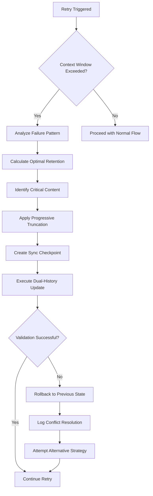
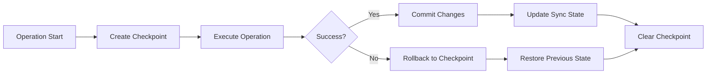

# PRD: Tool Call Retry Mechanism Enhancement

## 1. Title & Overview

- **Project:** Tool Call Retry Mechanism Enhancement
- **Summary:** This feature implements a separate active retry loop for tool call errors with better context error handling. The mechanism provides configurable retry attempts (2-4 times), handles both validation errors and execution failures, and integrates with the existing consecutive mistake count system. When tool calls fail due to transient issues, context limitations, or API errors, the system will automatically retry with adjusted parameters, improved context management, and exponential backoff strategies.
- **Dependencies:** This feature builds upon the existing tool call system, error handling framework, and context management infrastructure including ToolRepetitionDetector, consecutiveMistakeCount tracking, and experimental settings framework.

## 2. Goals & Success Metrics

### Business Objectives

- Improve tool call reliability and success rates
- Reduce user frustration from transient failures
- Enhance system resilience against network and API issues
- Provide better visibility into retry attempts and error recovery
- Maintain backward compatibility with existing tool call workflows

### Developer & System Success Metrics

- 40% reduction in tool call failure rates for retryable errors
- 90% of retryable errors resolved within 3 retry attempts
- Average retry completion time under 10 seconds
- User satisfaction score for tool reliability improves by 30%
- Zero increase in successful tool call latency

## 3. User Personas

- **Developer (Primary User):** A developer working on complex tasks who experiences intermittent tool call failures and wants automatic recovery without manual intervention. The developer needs the system to handle missing parameters, format validation errors, access/permission checks, and execution failures transparently.
- **Power User:** An experienced user who wants fine-grained control over retry behavior and visibility into retry attempts for debugging and optimization. This user needs to configure retry attempts (2-4 times), adjust backoff strategies, and monitor retry patterns.
- **System Administrator:** A user responsible for monitoring system health and needs visibility into retry patterns, failure rates, and integration with the consecutive mistake count system for system stability monitoring.

## 4. Requirements Breakdown

| Phase                   | Sprint                                                           | User Story                                                                                                                                                  | Acceptance Criteria                                                                                                                                                                                                                                                                                                                                                                                                                                                                                                                                                                                     | Duration    |
| :---------------------- | :--------------------------------------------------------------- | :---------------------------------------------------------------------------------------------------------------------------------------------------------- | :------------------------------------------------------------------------------------------------------------------------------------------------------------------------------------------------------------------------------------------------------------------------------------------------------------------------------------------------------------------------------------------------------------------------------------------------------------------------------------------------------------------------------------------------------------------------------------------------------ | ----------- |
| **Phase 1: Foundation** | **Sprint 1: Experimental Settings**                              | As a Developer, I want configurable retry settings so I can control retry behavior based on my needs and environment.                                       | 1. Experimental setting to control the retry mechanism with enable/disable toggle.<br>2. Configurable retry attempts (2-4 times as requested).<br>3. Settings persist across sessions via the experimental settings framework.<br>4. Default values provide sensible out-of-the-box behavior.<br>5. Settings integration with existing settings infrastructure.                                                                                                                                                                                                                                         | **2 Weeks** |
|                         |                                                                  | As a Developer, I want the system to detect retryable vs non-retryable errors so it can intelligently decide when to retry.                                 | 1. Error classifier identifies transient vs permanent failures.<br>2. Classification based on error codes, messages, and patterns.<br>3. Support for different error types: missing parameters, format validation, access/permission checks, execution failures.<br>4. Clear logging of classification decisions.                                                                                                                                                                                                                                                                                       |             |
| **Phase 1: Foundation** | **Sprint 2: Separate Active Retry Loop**                         | As a Developer, I want a separate active retry loop for tool call errors so transient failures are resolved without overwhelming the system.                | 1. Separate retry loop implementation independent of the main tool execution flow.<br>2. Configurable maximum retry attempts per tool call (2-4 times).<br>3. Retry attempts are logged with timestamps and results.<br>4. System respects rate limits and API constraints.<br>5. Integration with existing ToolRepetitionDetector.                                                                                                                                                                                                                                                                     | **2 Weeks** |
|                         |                                                                  | As a Developer, I want retry attempts to preserve original tool call context so retries maintain the same intent and parameters.                            | 1. Original tool call parameters are preserved across retries.<br>2. Context modifications are tracked and reversible.<br>3. Retry state is maintained across system restarts if needed.<br>4. Failed retries don't corrupt subsequent tool calls.<br>5. Integration with consecutiveMistakeCount tracking system.                                                                                                                                                                                                                                                                                      |             |
| **Phase 2: Context**    | **Sprint 3: Enhanced Context Management & Error Classification** | As a Developer, I want better context error handling for retries so context-related failures are resolved through improved context management.              | 1. Context optimizer identifies context-related errors.<br>2. Automatic context compression and pruning for retry attempts.<br>3. Preservation of critical context elements during optimization.<br>4. Context optimization is transparent to the user.<br>5. Enhanced error messages with context-specific recovery suggestions.<br>6. **NEW**: Integration with existing `truncateConversationIfNeeded` function.<br>7. **NEW**: Dual-history synchronization for `apiConversationHistory` and `clineMessages`.<br>8. **NEW**: Context state management to prevent exponential growth during retries. | **2 Weeks** |
|                         |                                                                  | As a Developer, I want different retry strategies for different error types so the system can adapt its approach based on the specific failure reason.      | 1. Context reduction strategy for token limit errors.<br>2. Parameter adjustment strategy for missing parameters and format validation errors.<br>3. Access/permission check strategy for authorization failures.<br>4. Execution failure strategy for runtime errors.<br>5. Fallback strategy for unknown error types.<br>6. **NEW**: Context-specific error classification with `handleContextWindowExceededError` integration.<br>7. **NEW**: Memory-aware retry strategies with exponential growth detection.<br>8. **NEW**: Context restoration mechanisms after failed retry attempts.            |             |
|                         |                                                                  | **NEW**: As a Developer, I want dual-history management during retries so both UI and API-facing conversation histories remain synchronized and consistent. | 1. Synchronize `apiConversationHistory` and `clineMessages` during all retry operations.<br>2. Prevent message duplication or loss during context optimization.<br>3. Maintain consistency between UI display and API context during retries.<br>4. Implement context state tracking across multiple retry attempts.<br>5. Provide context restoration capabilities after retry failures.<br>6. Monitor memory usage during context state management.<br>7. Validate context integrity after each retry attempt.                                                                                        |             |
| **Phase 2: Context**    | **Sprint 4: User Feedback & Integration**                        | As a Developer, I want user feedback during retry attempts so I can understand system behavior and debug issues when needed.                                | 1. Retry status indicator shows current retry state in UI.<br>2. Detailed retry logs available for debugging.<br>3. Retry metrics and statistics for monitoring.<br>4. User notifications for prolonged retry attempts.<br>5. Integration with existing tool handlers (executeCommandTool, applyDiffTool, useMcpToolTool).                                                                                                                                                                                                                                                                              | **2 Weeks** |
|                         |                                                                  | As a Developer, I want manual retry controls so I can override automatic behavior when needed for specific situations.                                      | 1. Manual retry button available after failed attempts.<br>2. Option to modify parameters before manual retry.<br>3. Ability to skip automatic retries and handle manually.<br>4. Clear feedback on manual retry results.<br>5. Integration with existing error handling (pushToolResult and recordToolError).                                                                                                                                                                                                                                                                                          |             |

## 5. Timeline & Sprints

- **Total Estimated Time:** 8 Weeks
- **Sprint 1:** Experimental Settings (2 Weeks)
- **Sprint 2:** Separate Active Retry Loop (2 Weeks)
- **Sprint 3:** Better Context Error Handling (2 Weeks)
- **Sprint 4:** User Feedback & Integration (2 Weeks)

## 6. Risks & Assumptions

### Assumptions

- Existing tool call system can be intercepted for retry logic
- Error messages provide sufficient information for classification
- Context window limits can be detected and measured accurately
- Users have sufficient permissions to modify retry settings
- API rate limits can be respected during retry attempts

### Risks

- Retry attempts may exacerbate rate limiting issues
- Context optimization may remove critical information
- Retry mechanism may increase system resource usage
- Users may be confused by automatic retry behavior
- Retry loops may create infinite recursion in edge cases

### Mitigations

- Implement intelligent backoff strategies and rate limit detection
- Preserve critical context elements and provide user override options
- Monitor resource usage and implement retry limits
- Provide clear user feedback and documentation
- Add safeguards and circuit breakers to prevent infinite loops

## 7. Success Metrics

- **Reliability Improvement:** 40% reduction in retryable tool call failures
- **User Experience:** 90% of retryable errors resolved within 3 attempts
- **Performance:** Average retry completion time under 10 seconds
- **Adoption:** 70% of users enable retry feature within the first month
- **System Health:** No increase in system resource usage or latency
- **Context Synchronization Success:** 95% successful synchronization between `apiConversationHistory` and `clineMessages` during retries
- **Memory Usage Efficiency:** < 5MB additional memory usage during retry operations, with no exponential growth during multiple retries
- **Context Preservation Accuracy:** 98% preservation of critical context elements during optimization
- **Integration Reliability:** 99% successful integration with existing `truncateConversationIfNeeded` system
- **Context State Management:** Zero context corruption incidents during retry sequences

## Technical Specifications: Dual-History Synchronization & Context Optimization

### 8.1 Dual-History Synchronization Architecture

#### 8.1.1 Synchronization State Management

```typescript
interface HistorySyncState {
	apiConversationHistory: ApiMessage[]
	clineMessages: ClineMessage[]
	lastSyncTimestamp: number
	syncStatus: "synchronized" | "api-ahead" | "cline-ahead" | "conflict"
	pendingOperations: SyncOperation[]
}

interface SyncOperation {
	id: string
	type: "add" | "update" | "remove" | "truncate"
	target: "api" | "cline" | "both"
	data: any
	timestamp: number
	retryAttempt?: number
}
```

#### 8.1.2 Synchronization Mechanism

1. **Dual-Write Pattern**: All modifications to conversation history must update both `apiConversationHistory` and `clineMessages` atomically
2. **Conflict Resolution**: When histories diverge, use timestamp-based reconciliation with retry-aware prioritization
3. **Sync Checkpoints**: Create synchronization checkpoints before retry operations to enable rollback
4. **Validation Layer**: Continuous consistency checking with automatic correction mechanisms

#### 8.1.3 Conflict Resolution Strategies

```typescript
enum ConflictResolutionStrategy {
	RETRY_WINS = "retry_wins", // Retry operation takes precedence
	TIMESTAMP_WINS = "timestamp_wins", // Most recent timestamp wins
	MERGE_SMART = "merge_smart", // Intelligent merge based on content analysis
	USER_PROMPT = "user_prompt", // Prompt user for resolution
}
```

### 8.2 Retry Engine Integration with Context Optimization

#### 8.2.1 Enhanced TruncateConversationIfNeeded Wrapper

```typescript
interface RetryAwareTruncateOptions extends TruncateOptions {
	retryAttempt: number
	maxRetries: number
	syncState: HistorySyncState
	originalApiHistory: ApiMessage[]
	originalClineHistory: ClineMessage[]
	failureReason: "context_window" | "rate_limit" | "network" | "unknown"
}

interface RetryTruncateResponse extends TruncateResponse {
	syncOperations: SyncOperation[]
	rollbackData: {
		apiHistory: ApiMessage[]
		clineHistory: ClineMessage[]
	}
	conflictResolutions: ConflictResolution[]
}
```

#### 8.2.2 Context Optimization Triggers

1. **Pre-Retry Optimization**: Before each retry, analyze context usage patterns and optimize accordingly
2. **Progressive Truncation**: Start with conservative truncation, increase aggressiveness based on failure patterns
3. **Content-Aware Pruning**: Preserve critical context elements (tool results, user feedback, error states)
4. **Memory Pressure Detection**: Monitor token usage and trigger proactive optimization

#### 8.2.3 Retry-Specific Strategies

```typescript
class RetryContextOptimizer {
	// Analyze failure patterns to determine optimal truncation strategy
	analyzeFailurePattern(retryAttempts: number, failureReasons: string[]): TruncationStrategy

	// Determine optimal retention percentage based on retry context
	calculateOptimalRetention(contextWindow: number, retryAttempt: number): number

	// Preserve critical context elements during truncation
	identifyCriticalContent(messages: ApiMessage[]): CriticalContent[]

	// Implement progressive context reduction
	applyProgressiveTruncation(messages: ApiMessage[], targetReduction: number, maxRetries: number): ApiMessage[]
}
```

### 8.3 Context Restoration and Recovery

#### 8.3.1 Checkpoint System

```typescript
interface ContextCheckpoint {
	id: string
	timestamp: number
	retryAttempt: number
	apiHistory: ApiMessage[]
	clineHistory: ClineMessage[]
	tokenUsage: TokenUsage
	contextWindow: number
	compressionState: {
		strategy: "sliding_window" | "llm_summarization" | "hybrid"
		retentionPercent: number
		summary?: string
	}
	syncState: HistorySyncState
}
```

#### 8.3.2 Restoration Strategies

1. **Immediate Restoration**: Restore from last successful checkpoint
2. **Progressive Restoration**: Gradually rebuild context if checkpoints are unavailable
3. **Selective Restoration**: Restore only essential context elements on final retry attempts
4. **Emergency Fallback**: Minimal context restoration to enable task completion

#### 8.3.3 Rollback Mechanisms

```typescript
class ContextRollbackManager {
	// Create rollback points before risky operations
	createRollbackPoint(operation: SyncOperation): RollbackPoint

	// Execute atomic rollback with validation
	executeRollback(rollbackPoint: RollbackPoint): Promise<void>

	// Verify rollback integrity
	validateRollbackIntegrity(before: HistorySyncState, after: HistorySyncState): boolean

	// Handle rollback failures gracefully
	handleRollbackFailure(failure: RollbackFailure): Promise<void>
}
```

### 8.4 Performance Optimization

#### 8.4.1 Memory Management

```typescript
interface MemoryUsageTracker {
	currentTokens: number
	peakTokens: number
	averageTokens: number
	trendData: TokenUsagePoint[]
	optimizationTriggers: OptimizationTrigger[]
}

interface OptimizationTrigger {
	type: "token_threshold" | "growth_rate" | "retry_pattern" | "time_based"
	threshold: number
	action: "compress" | "truncate" | "summarize" | "checkpoint"
	lastTriggered: number
}
```

#### 8.4.2 Efficient Synchronization

1. **Batch Operations**: Group multiple history changes into atomic batches
2. **Lazy Synchronization**: Defer non-critical sync operations during retry cycles
3. **Differential Updates**: Track and sync only changed portions of conversation history
4. **Background Processing**: Perform heavy synchronization operations in background threads

### 8.5 Data Flow Patterns

#### 8.5.1 Context Optimization Flow



#### 8.5.2 Synchronization Checkpoints



### 8.6 Integration Points

#### 8.6.1 Task.ts Integration

- **Method Integration**: Extend existing `handleContextWindowExceededError()` method
- **State Management**: Integrate with current `apiConversationHistory` and `clineMessages` arrays
- **Retry Coordination**: Hook into existing `attemptApiRequest()` retry mechanism
- **Event System**: Utilize existing Task event system for synchronization notifications

#### 8.6.2 Sliding Window Integration

- **Function Enhancement**: Wrap `truncateConversationIfNeeded()` with retry-aware logic
- **Parameter Extension**: Add retry-specific parameters to existing `TruncateOptions`
- **Response Enhancement**: Extend `TruncateResponse` with synchronization metadata
- **Backward Compatibility**: Maintain existing API while adding new functionality

#### 8.6.3 Error Handling Integration

- **Error Detection**: Utilize existing `checkContextWindowExceededError()` function
- **Retry Logic**: Integrate with existing `MAX_CONTEXT_WINDOW_RETRIES` constant
- **Recovery Strategy**: Hook into existing exponential backoff mechanism
- **User Communication**: Leverage existing `say()` method for status updates

### 8.7 Implementation Examples

#### 8.7.1 Basic Synchronization

```typescript
class DualHistoryManager {
	private syncState: HistorySyncState
	private retryAttempts: number = 0

	async synchronizeHistories(
		apiHistory: ApiMessage[],
		clineHistory: ClineMessage[],
		operation: SyncOperation,
	): Promise<void> {
		// Create checkpoint before operation
		const checkpoint = await this.createCheckpoint()

		try {
			// Execute atomic dual-write
			await this.performAtomicUpdate(apiHistory, clineHistory, operation)

			// Verify synchronization
			const isValid = await this.validateSynchronization()
			if (!isValid) {
				throw new Error("Synchronization validation failed")
			}

			this.updateSyncState("synchronized")
		} catch (error) {
			// Rollback on failure
			await this.rollbackToCheckpoint(checkpoint)
			throw error
		}
	}
}
```

#### 8.7.2 Retry-Aware Truncation

```typescript
class RetryAwareContextOptimizer {
	async optimizeForRetry(
		messages: ApiMessage[],
		retryAttempt: number,
		failureReason: string,
	): Promise<RetryTruncateResponse> {
		// Analyze failure pattern
		const strategy = this.analyzeFailurePattern(retryAttempt, failureReason)

		// Calculate optimal retention
		const retentionPercent = this.calculateOptimalRetention(messages.length, retryAttempt, strategy)

		// Preserve critical content
		const criticalContent = this.identifyCriticalContent(messages)

		// Apply progressive truncation
		const truncatedMessages = this.applyProgressiveTruncation(messages, retentionPercent, criticalContent)

		// Create sync operations
		const syncOperations = this.createSyncOperations(messages, truncatedMessages, retryAttempt)

		return {
			messages: truncatedMessages,
			syncOperations,
			rollbackData: {
				apiHistory: messages,
				clineHistory: await this.mapToClineMessages(messages),
			},
			conflictResolutions: [],
		}
	}
}
```

#### 8.7.3 Context Restoration

```typescript
class ContextRestorationManager {
	async restoreFromCheckpoint(
		checkpointId: string,
		restorationStrategy: "full" | "progressive" | "minimal" = "full",
	): Promise<void> {
		const checkpoint = await this.loadCheckpoint(checkpointId)
		if (!checkpoint) {
			throw new Error(`Checkpoint ${checkpointId} not found`)
		}

		switch (restorationStrategy) {
			case "full":
				await this.performFullRestoration(checkpoint)
				break
			case "progressive":
				await this.performProgressiveRestoration(checkpoint)
				break
			case "minimal":
				await this.performMinimalRestoration(checkpoint)
				break
		}

		// Validate restoration integrity
		const isValid = await this.validateRestorationIntegrity(checkpoint)
		if (!isValid) {
			await this.handleRestorationFailure(checkpoint)
		}
	}
}
```

## 8. Dependencies

### Technical Dependencies

- Existing tool call system (src/core/tools/)
- ToolRepetitionDetector for preventing infinite loops
- consecutiveMistakeCount tracking system
- Error handling framework (src/core/tools/validateToolUse.ts)
- Context management system (src/core/context-compression/)
- **NEW**: Task.ts context system integration (`src/core/task/Task.ts`)
- **NEW**: `truncateConversationIfNeeded` function (`src/core/sliding-window/index.ts:102`)
- **NEW**: `apiConversationHistory` and `clineMessages` synchronization
- **NEW**: `handleContextWindowExceededError` method (`src/core/task/Task.ts:2652`)
- **NEW**: `MAX_CONTEXT_WINDOW_RETRIES` constant (`src/core/task/Task.ts:124`)
- Experimental settings framework (packages/types/src/global-settings.ts)
- Tool handlers (executeCommandTool, applyDiffTool, useMcpToolTool)
- Error handling with pushToolResult and recordToolError
- Frontend settings panel (webview-ui/src/components/settings/)

### External Dependencies

- API rate limit information from external services
- Error code documentation from tool providers
- Network connectivity for retry attempts
- System resources for retry state management

### Integration Points

- Tool call execution pipeline for retry interception
- Error handling system for classification and routing
- Settings panel for retry configuration
- UI components for retry status and feedback
- Logging system for retry monitoring and debugging
- Integration with existing consecutive mistake count system
- Compatibility with existing tool handler workflows

## 9. Architecture Recommendations

### 9.1 Retry Engine Architecture Overview

#### 9.1.1 Core Component Design

```typescript
interface RetryEngine {
	// Main retry coordination
	executeWithRetry<T>(toolCall: ToolCall, context: RetryContext): Promise<T>

	// Context optimization integration
	wrapTruncateFunction(originalTruncate: TruncateFunction): RetryAwareTruncateFunction

	// Dual-history synchronization
	synchronizeHistories(operation: HistoryOperation): Promise<SyncResult>

	// State management
	createRetryState(attempt: number, maxRetries: number): RetryState
	updateRetryState(state: RetryState, result: RetryResult): void
}

interface RetryContext {
	originalToolCall: ToolCall
	attemptNumber: number
	maxRetries: number
	failureReason: FailureReason
	apiConversationHistory: ApiMessage[]
	clineMessages: ClineMessage[]
	syncState: HistorySyncState
	contextWindow: ContextWindowInfo
}
```

#### 9.1.2 Context-Aware Retry Logic Integration

The retry engine must wrap the existing `truncateConversationIfNeeded` function to provide context optimization during retry attempts:

```typescript
class RetryAwareContextManager {
	private originalTruncate: TruncateFunction

	constructor(originalTruncate: TruncateFunction) {
		this.originalTruncate = originalTruncate
	}

	async truncateForRetry(messages: ApiMessage[], options: RetryTruncateOptions): Promise<RetryTruncateResponse> {
		// 1. Create synchronization checkpoint
		const checkpoint = await this.createSyncCheckpoint(messages)

		try {
			// 2. Apply progressive context optimization
			const optimizedMessages = await this.applyProgressiveOptimization(
				messages,
				options.retryAttempt,
				options.maxRetries,
			)

			// 3. Execute original truncate with enhanced options
			const truncateResult = await this.originalTruncate(optimizedMessages, {
				...options,
				retryContext: {
					attempt: options.retryAttempt,
					failureReason: options.failureReason,
					criticalElements: this.identifyCriticalElements(messages),
				},
			})

			// 4. Synchronize dual histories
			await this.synchronizeDualHistories(truncateResult.messages, checkpoint)

			return {
				...truncateResult,
				syncOperations: checkpoint.syncOperations,
				rollbackData: checkpoint.rollbackData,
			}
		} catch (error) {
			// 5. Restore context on failure
			await this.restoreFromCheckpoint(checkpoint)
			throw error
		}
	}
}
```

### 9.2 Dual-History Synchronization Implementation

#### 9.2.1 Synchronization Architecture

```typescript
class DualHistorySynchronizer {
	private apiHistory: ApiMessage[]
	private clineHistory: ClineMessage[]
	private syncState: HistorySyncState
	private conflictResolver: ConflictResolver

	async synchronizeOperation(operation: SyncOperation): Promise<void> {
		// 1. Pre-operation validation
		await this.validatePreOperationState(operation)

		// 2. Create atomic transaction
		const transaction = await this.createSyncTransaction(operation)

		try {
			// 3. Execute dual-write operation
			await this.executeDualWrite(transaction)

			// 4. Verify consistency
			const isConsistent = await this.verifyConsistency()
			if (!isConsistent) {
				throw new Error("Dual-history consistency check failed")
			}

			// 5. Commit transaction
			await this.commitTransaction(transaction)
		} catch (error) {
			// 6. Rollback on failure
			await this.rollbackTransaction(transaction)
			throw error
		}
	}

	private async executeDualWrite(transaction: SyncTransaction): Promise<void> {
		const { operation, apiHistory, clineHistory } = transaction

		// Atomic updates to both histories
		const apiPromise = this.updateApiHistory(apiHistory, operation)
		const clinePromise = this.updateClineHistory(clineHistory, operation)

		// Wait for both operations to complete
		await Promise.all([apiPromise, clinePromise])

		// Update sync state
		this.syncState.lastSyncTimestamp = Date.now()
		this.syncState.syncStatus = "synchronized"
	}
}
```

#### 9.2.2 Context Restoration Mechanisms

```typescript
class ContextRestorationManager {
	private checkpoints: Map<string, ContextCheckpoint> = new Map()

	async createContextCheckpoint(
		apiHistory: ApiMessage[],
		clineHistory: ClineMessage[],
		retryAttempt: number,
	): Promise<string> {
		const checkpoint: ContextCheckpoint = {
			id: this.generateCheckpointId(),
			timestamp: Date.now(),
			retryAttempt,
			apiHistory: [...apiHistory], // Deep copy
			clineHistory: [...clineHistory], // Deep copy
			tokenUsage: this.calculateTokenUsage(apiHistory),
			contextWindow: this.getContextWindowSize(),
			compressionState: {
				strategy: "sliding_window",
				retentionPercent: this.calculateRetentionPercent(retryAttempt),
			},
			syncState: this.getCurrentSyncState(),
		}

		this.checkpoints.set(checkpoint.id, checkpoint)
		return checkpoint.id
	}

	async restoreFromCheckpoint(checkpointId: string, strategy: RestorationStrategy = "full"): Promise<void> {
		const checkpoint = this.checkpoints.get(checkpointId)
		if (!checkpoint) {
			throw new Error(`Checkpoint ${checkpointId} not found`)
		}

		switch (strategy) {
			case "full":
				await this.performFullRestoration(checkpoint)
				break
			case "progressive":
				await this.performProgressiveRestoration(checkpoint)
				break
			case "selective":
				await this.performSelectiveRestoration(checkpoint)
				break
		}

		// Validate restoration integrity
		const isValid = await this.validateRestorationIntegrity(checkpoint)
		if (!isValid) {
			throw new Error("Context restoration validation failed")
		}
	}

	private async performFullRestoration(checkpoint: ContextCheckpoint): Promise<void> {
		// Restore complete conversation state
		this.apiConversationHistory = [...checkpoint.apiHistory]
		this.clineMessages = [...checkpoint.clineHistory]

		// Restore compression state
		await this.restoreCompressionState(checkpoint.compressionState)

		// Update sync state
		this.syncState = { ...checkpoint.syncState }
	}
}
```

### 9.3 Memory-Efficient State Management

#### 9.3.1 State Management Architecture

```typescript
class MemoryEfficientRetryState {
	private retryStates: Map<string, RetryState> = new Map()
	private memoryTracker: MemoryUsageTracker
	private cleanupScheduler: CleanupScheduler

	constructor() {
		this.memoryTracker = new MemoryUsageTracker()
		this.cleanupScheduler = new CleanupScheduler()
		this.schedulePeriodicCleanup()
	}

	createRetryState(toolCallId: string, maxRetries: number): RetryState {
		const state: RetryState = {
			id: this.generateStateId(toolCallId),
			toolCallId,
			attemptNumber: 0,
			maxRetries,
			startTime: Date.now(),
			lastAttemptTime: 0,
			failureReasons: [],
			contextSnapshots: [],
			memoryUsage: {
				initialTokens: 0,
				currentTokens: 0,
				peakTokens: 0,
			},
		}

		this.retryStates.set(state.id, state)
		this.memoryTracker.trackStateCreation(state)

		return state
	}

	updateRetryState(stateId: string, result: RetryResult): void {
		const state = this.retryStates.get(stateId)
		if (!state) return

		state.attemptNumber++
		state.lastAttemptTime = Date.now()
		state.failureReasons.push(result.failureReason)

		// Manage memory efficiently
		if (result.contextSnapshot) {
			this.addContextSnapshot(state, result.contextSnapshot)
		}

		// Trigger cleanup if memory threshold exceeded
		if (this.memoryTracker.shouldTriggerCleanup()) {
			this.cleanupScheduler.scheduleImmediateCleanup()
		}
	}

	private addContextSnapshot(state: RetryState, snapshot: ContextSnapshot): void {
		// Keep only recent snapshots to prevent memory bloat
		state.contextSnapshots = state.contextSnapshots.slice(-this.MAX_SNAPSHOTS_PER_STATE).concat(snapshot)

		// Update memory usage tracking
		state.memoryUsage.currentTokens = this.calculateSnapshotTokens(snapshot)
		state.memoryUsage.peakTokens = Math.max(state.memoryUsage.peakTokens, state.memoryUsage.currentTokens)
	}
}
```

#### 9.3.2 Context Bloat Prevention

```typescript
class ContextBloatPreventer {
  private readonly MAX_CONTEXT_GROWTH_RATE = 1.5 // 50% growth limit
  private readonly MAX_RETRY_CONTEXT_SIZE = 100000 // tokens
  private readonly CRITICAL_ELEMENT_PRESERVATION_RATIO = 0.8 // 80% preservation

  async preventContextBloat(
    messages: ApiMessage[],
    retryAttempt: number,
    baseContextSize: number
  ): Promise<ApiMessage[]> {
    const currentSize = this.calculateTokenCount(messages)
    const growthRate = currentSize / baseContextSize

    // Check for exponential growth
    if (growthRate > this.MAX_CONTEXT_GROWTH_RATE) {
      console.warn(`Context growth rate ${growthRate} exceeds threshold ${this.MAX_CONTEXT_GROWTH_RATE}`)
      return this.applyAggressiveOptimization(messages, retryAttempt)
    }

    // Check absolute size limits
    if (currentSize > this.MAX_RETRY_CONTEXT_SIZE) {
      return this.applySizeLimitOptimization(messages, retryAttempt)
    }

    // Apply progressive optimization based on retry count
    return this.applyProgressiveOptimization(messages, retryAttempt)
  }

  private applyAggressiveOptimization(
    messages: ApiMessage[],
    retryAttempt: number
  ): ApiMessage[]> {
    // Preserve only critical elements
    const criticalElements = this.identifyCriticalElements(messages)
    const preservedCount = Math.floor(
      messages.length * this.CRITICAL_ELEMENT_PRESERVATION_RATIO
    )

    return criticalElements.slice(0, preservedCount)
  }

  private identifyCriticalElements(messages: ApiMessage[]): ApiMessage[] {
    return messages.filter(message => {
      // Preserve tool results, error messages, and recent user inputs
      return (
        message.type === 'tool_result' ||
        message.type === 'error' ||
        (message.type === 'user' && this.isRecentMessage(message)) ||
        this.containsCriticalContext(message)
      )
    }).sort((a, b) => {
      // Sort by importance and recency
      return this.calculateMessageImportance(b) - this.calculateMessageImportance(a)
    })
  }
}
```

### 9.4 Context Management Strategies

#### 9.4.1 Context Optimization Triggers

```typescript
interface ContextOptimizationTrigger {
	type: "token_threshold" | "growth_rate" | "retry_pattern" | "memory_pressure"
	threshold: number
	action: OptimizationAction
	strategy: OptimizationStrategy
}

class ContextOptimizationManager {
	private triggers: ContextOptimizationTrigger[] = [
		{
			type: "token_threshold",
			threshold: 0.8, // 80% of context window
			action: "compress",
			strategy: "sliding_window",
		},
		{
			type: "growth_rate",
			threshold: 1.5, // 50% growth
			action: "truncate",
			strategy: "aggressive",
		},
		{
			type: "retry_pattern",
			threshold: 3, // 3rd retry
			action: "summarize",
			strategy: "llm_summarization",
		},
		{
			type: "memory_pressure",
			threshold: 0.9, // 90% memory usage
			action: "emergency_cleanup",
			strategy: "minimal_context",
		},
	]

	async evaluateOptimizationNeeds(context: RetryContext, retryAttempt: number): Promise<OptimizationDecision> {
		const tokenUsage = this.calculateTokenUsage(context.apiConversationHistory)
		const growthRate = this.calculateGrowthRate(context)
		const memoryPressure = this.getMemoryPressure()

		for (const trigger of this.triggers) {
			if (
				this.shouldTriggerOptimization(trigger, {
					tokenUsage,
					growthRate,
					memoryPressure,
					retryAttempt,
				})
			) {
				return {
					shouldOptimize: true,
					action: trigger.action,
					strategy: trigger.strategy,
					priority: this.calculateOptimizationPriority(trigger, retryAttempt),
				}
			}
		}

		return { shouldOptimize: false }
	}

	private shouldTriggerOptimization(trigger: ContextOptimizationTrigger, metrics: OptimizationMetrics): boolean {
		switch (trigger.type) {
			case "token_threshold":
				return metrics.tokenUsage > trigger.threshold
			case "growth_rate":
				return metrics.growthRate > trigger.threshold
			case "retry_pattern":
				return metrics.retryAttempt >= trigger.threshold
			case "memory_pressure":
				return metrics.memoryPressure > trigger.threshold
			default:
				return false
		}
	}
}
```

#### 9.4.2 Progressive Context Reduction

```typescript
class ProgressiveContextReducer {
	private readonly REDUCTION_STAGES = [
		{ attempt: 1, reduction: 0.1, strategy: "conservative" }, // 10% reduction
		{ attempt: 2, reduction: 0.25, strategy: "moderate" }, // 25% reduction
		{ attempt: 3, reduction: 0.4, strategy: "aggressive" }, // 40% reduction
		{ attempt: 4, reduction: 0.6, strategy: "emergency" }, // 60% reduction
	]

	async applyProgressiveReduction(messages: ApiMessage[], retryAttempt: number): Promise<ApiMessage[]> {
		const stage = this.getReductionStage(retryAttempt)
		if (!stage) {
			return messages // No reduction needed
		}

		const criticalElements = await this.identifyCriticalElements(messages)
		const nonCriticalElements = messages.filter((msg) => !criticalElements.includes(msg))

		// Apply stage-specific reduction strategy
		switch (stage.strategy) {
			case "conservative":
				return this.applyConservativeReduction(messages, criticalElements, nonCriticalElements, stage.reduction)

			case "moderate":
				return this.applyModerateReduction(messages, criticalElements, nonCriticalElements, stage.reduction)

			case "aggressive":
				return this.applyAggressiveReduction(messages, criticalElements, nonCriticalElements, stage.reduction)

			case "emergency":
				return this.applyEmergencyReduction(messages, criticalElements, nonCriticalElements, stage.reduction)
		}
	}

	private applyConservativeReduction(
		messages: ApiMessage[],
		criticalElements: ApiMessage[],
		nonCriticalElements: ApiMessage[],
		reductionRatio: number,
	): ApiMessage[] {
		// Remove oldest non-critical messages first
		const toRemove = Math.floor(nonCriticalElements.length * reductionRatio)
		const oldestToRemove = nonCriticalElements.slice(0, toRemove)

		return messages.filter((msg) => !oldestToRemove.includes(msg))
	}

	private applyAggressiveReduction(
		messages: ApiMessage[],
		criticalElements: ApiMessage[],
		nonCriticalElements: ApiMessage[],
		reductionRatio: number,
	): ApiMessage[] {
		// Combine multiple reduction strategies
		const toRemove = Math.floor(nonCriticalElements.length * reductionRatio)

		// Remove oldest non-critical messages
		const oldestToRemove = nonCriticalElements.slice(0, Math.floor(toRemove * 0.7))

		// Compress remaining non-critical messages
		const compressedMessages = await this.compressMessages(nonCriticalElements.slice(oldestToRemove.length))

		return [...criticalElements, ...compressedMessages]
	}
}
```

### 9.5 Performance and Memory Requirements

#### 9.5.1 Performance Targets

```typescript
interface PerformanceTargets {
	// Retry operation timing
	maxRetryLatency: number // 10 seconds maximum
	averageRetryLatency: number // 5 seconds average
	contextOptimizationTime: number // 2 seconds maximum

	// Memory usage limits
	maxRetryMemoryUsage: number // 5MB additional memory
	maxContextGrowthRate: number // 1.5x growth limit
	maxStateRetentionTime: number // 30 minutes maximum

	// Synchronization performance
	maxSyncLatency: number // 1 second maximum
	syncSuccessRate: number // 99.5% success rate
	maxSyncRetries: number // 3 maximum sync retries
}

class PerformanceMonitor {
	private targets: PerformanceTargets = {
		maxRetryLatency: 10000,
		averageRetryLatency: 5000,
		contextOptimizationTime: 2000,
		maxRetryMemoryUsage: 5 * 1024 * 1024, // 5MB
		maxContextGrowthRate: 1.5,
		maxStateRetentionTime: 30 * 60 * 1000, // 30 minutes
		maxSyncLatency: 1000,
		syncSuccessRate: 0.995,
		maxSyncRetries: 3,
	}

	async monitorRetryPerformance(operation: RetryOperation): Promise<PerformanceReport> {
		const startTime = Date.now()
		const startMemory = this.getCurrentMemoryUsage()

		try {
			const result = await this.executeOperation(operation)
			const endTime = Date.now()
			const endMemory = this.getCurrentMemoryUsage()

			return this.createPerformanceReport({
				operation,
				startTime,
				endTime,
				startMemory,
				endMemory,
				success: true,
				result,
			})
		} catch (error) {
			const endTime = Date.now()
			const endMemory = this.getCurrentMemoryUsage()

			return this.createPerformanceReport({
				operation,
				startTime,
				endTime,
				startMemory,
				endMemory,
				success: false,
				error,
			})
		}
	}

	private createPerformanceReport(metrics: PerformanceMetrics): PerformanceReport {
		const latency = metrics.endTime - metrics.startTime
		const memoryDelta = metrics.endMemory - metrics.startMemory

		return {
			operationId: metrics.operation.id,
			latency,
			memoryUsage: memoryDelta,
			success: metrics.success,
			withinTargets: {
				latency: latency <= this.targets.maxRetryLatency,
				memory: Math.abs(memoryDelta) <= this.targets.maxRetryMemoryUsage,
			},
			recommendations: this.generateRecommendations(latency, memoryDelta),
		}
	}
}
```

#### 9.5.2 Memory Management and Garbage Collection

```typescript
class MemoryManager {
	private memoryPool: Map<string, MemoryBlock> = new Map()
	private gcScheduler: GCScheduler
	private memoryMonitor: MemoryMonitor

	constructor() {
		this.gcScheduler = new GCScheduler()
		this.memoryMonitor = new MemoryMonitor()
		this.schedulePeriodicGC()
	}

	allocateRetryState(retryState: RetryState): string {
		const blockId = this.generateBlockId()
		const blockSize = this.calculateStateSize(retryState)

		// Check memory limits before allocation
		if (this.wouldExceedMemoryLimits(blockSize)) {
			this.triggerEmergencyCleanup()
		}

		const memoryBlock: MemoryBlock = {
			id: blockId,
			size: blockSize,
			data: retryState,
			createdAt: Date.now(),
			lastAccessed: Date.now(),
			accessCount: 0,
		}

		this.memoryPool.set(blockId, memoryBlock)
		return blockId
	}

	releaseRetryState(blockId: string): void {
		const block = this.memoryPool.get(blockId)
		if (block) {
			// Clear references to help GC
			block.data = null
			this.memoryPool.delete(blockId)
		}
	}

	private triggerEmergencyCleanup(): void {
		// Release least recently used states
		const sortedBlocks = Array.from(this.memoryPool.values()).sort((a, b) => a.lastAccessed - b.lastAccessed)

		const toRelease = Math.floor(sortedBlocks.length * 0.3) // Release 30%
		for (let i = 0; i < toRelease; i++) {
			this.releaseRetryState(sortedBlocks[i].id)
		}

		// Force garbage collection if available
		if (global.gc) {
			global.gc()
		}
	}

	private schedulePeriodicGC(): void {
		setInterval(
			() => {
				this.cleanupExpiredStates()
				this.optimizeMemoryUsage()
			},
			5 * 60 * 1000,
		) // Every 5 minutes
	}

	private cleanupExpiredStates(): void {
		const now = Date.now()
		const maxAge = 30 * 60 * 1000 // 30 minutes

		for (const [blockId, block] of this.memoryPool.entries()) {
			if (now - block.createdAt > maxAge) {
				this.releaseRetryState(blockId)
			}
		}
	}
}
```

### 9.6 Integration Guidelines

#### 9.6.1 Seamless Integration with Existing Tool Call System

```typescript
class ToolCallRetryIntegrator {
	private originalExecuteTool: ExecuteToolFunction
	private retryEngine: RetryEngine

	constructor(originalExecuteTool: ExecuteToolFunction) {
		this.originalExecuteTool = originalExecuteTool
		this.retryEngine = new RetryEngine()
	}

	async executeWithRetrySupport(toolCall: ToolCall): Promise<ToolResult> {
		// Check if retry is enabled for this tool call
		if (!this.shouldEnableRetry(toolCall)) {
			return this.originalExecuteTool(toolCall)
		}

		// Create retry context
		const retryContext = await this.createRetryContext(toolCall)

		try {
			// Execute with retry support
			return await this.retryEngine.executeWithRetry(toolCall, retryContext)
		} catch (error) {
			// Fallback to original execution if retry fails
			console.warn("Retry mechanism failed, falling back to original execution:", error)
			return this.originalExecuteTool(toolCall)
		}
	}

	private shouldEnableRetry(toolCall: ToolCall): boolean {
		// Check experimental settings
		const retrySettings = this.getRetrySettings()
		if (!retrySettings.enabled) {
			return false
		}

		// Check if tool call type supports retry
		return this.isRetryableToolType(toolCall.type)
	}

	private async createRetryContext(toolCall: ToolCall): Promise<RetryContext> {
		return {
			originalToolCall: toolCall,
			attemptNumber: 0,
			maxRetries: this.getMaxRetries(),
			failureReason: null,
			apiConversationHistory: this.getApiConversationHistory(),
			clineMessages: this.getClineMessages(),
			syncState: this.getCurrentSyncState(),
			contextWindow: this.getContextWindowInfo(),
		}
	}
}
```

#### 9.6.2 Backward Compatibility with Error Handling

```typescript
class BackwardCompatibilityLayer {
	private originalErrorHandler: ErrorHandler
	private retryErrorHandler: RetryErrorHandler

	constructor(originalErrorHandler: ErrorHandler) {
		this.originalErrorHandler = originalErrorHandler
		this.retryErrorHandler = new RetryErrorHandler()
	}

	async handleError(error: ToolError, context: ErrorContext): Promise<ErrorHandlingResult> {
		// Try retry-specific error handling first
		if (this.isRetryableError(error)) {
			try {
				return await this.retryErrorHandler.handleRetryError(error, context)
			} catch (retryError) {
				// Fall back to original error handling if retry handling fails
				console.warn("Retry error handling failed, using original handler:", retryError)
			}
		}

		// Use original error handling for non-retryable errors or fallback
		return this.originalErrorHandler.handleError(error, context)
	}

	private isRetryableError(error: ToolError): boolean {
		// Check if error is retryable based on type and message
		const retryableErrorTypes = [
			"CONTEXT_WINDOW_EXCEEDED",
			"RATE_LIMIT_EXCEEDED",
			"NETWORK_TIMEOUT",
			"TEMPORARY_API_ERROR",
		]

		return retryableErrorTypes.includes(error.type) || this.containsRetryableKeywords(error.message)
	}

	private containsRetryableKeywords(message: string): boolean {
		const retryableKeywords = ["context window", "token limit", "rate limit", "timeout", "temporary", "try again"]

		const lowerMessage = message.toLowerCase()
		return retryableKeywords.some((keyword) => lowerMessage.includes(keyword))
	}
}
```

#### 9.6.3 Minimal Performance Impact on Successful Operations

```typescript
class PerformanceOptimizedRetryEngine {
	private fastPath: FastPathExecutor
	private retryPath: RetryPathExecutor

	constructor() {
		this.fastPath = new FastPathExecutor()
		this.retryPath = new RetryPathExecutor()
	}

	async execute<T>(toolCall: ToolCall, context: ExecutionContext): Promise<T> {
		// Fast path for successful operations (no retry overhead)
		if (this.shouldUseFastPath(toolCall, context)) {
			return this.fastPath.execute(toolCall, context)
		}

		// Retry path with full retry logic
		return this.retryPath.execute(toolCall, context)
	}

	private shouldUseFastPath(toolCall: ToolCall, context: ExecutionContext): boolean {
		// Use fast path if:
		// 1. Retry is disabled
		// 2. No previous failures for this tool type
		// 3. Context is within safe limits
		// 4. No memory pressure

		return (
			!this.isRetryEnabled() ||
			!this.hasPreviousFailures(toolCall.type) ||
			this.isContextSafe(context) ||
			!this.hasMemoryPressure()
		)
	}
}

class FastPathExecutor {
	async execute<T>(toolCall: ToolCall, context: ExecutionContext): Promise<T> {
		// Direct execution without retry overhead
		// Minimal monitoring and logging
		// No context optimization or synchronization

		const startTime = Date.now()

		try {
			const result = await this.executeDirectly(toolCall, context)

			// Minimal logging for successful operations
			this.logSuccessfulExecution(toolCall, Date.now() - startTime)

			return result
		} catch (error) {
			// Log error and let retry path handle it
			this.logExecutionError(toolCall, error)
			throw error
		}
	}
}
```

#### 9.6.4 Comprehensive Logging and Monitoring

```typescript
class RetryMonitoringSystem {
	private logger: RetryLogger
	private metricsCollector: MetricsCollector
	private alertManager: AlertManager

	constructor() {
		this.logger = new RetryLogger()
		this.metricsCollector = new MetricsCollector()
		this.alertManager = new AlertManager()
	}

	async monitorRetryOperation(operation: RetryOperation, context: RetryContext): Promise<MonitoringResult> {
		const operationId = this.generateOperationId()

		// Start monitoring
		this.logger.startOperation(operationId, operation, context)
		this.metricsCollector.startMetrics(operationId)

		try {
			const result = await this.executeWithMonitoring(operation, context)

			// Record successful operation
			this.logger.recordSuccess(operationId, result)
			this.metricsCollector.recordSuccess(operationId, result)

			return result
		} catch (error) {
			// Record failed operation
			this.logger.recordFailure(operationId, error)
			this.metricsCollector.recordFailure(operationId, error)

			// Check for alert conditions
			await this.checkAlertConditions(operationId, error, context)

			throw error
		} finally {
			// Complete monitoring
			this.logger.completeOperation(operationId)
			this.metricsCollector.completeMetrics(operationId)
		}
	}

	private async checkAlertConditions(operationId: string, error: Error, context: RetryContext): Promise<void> {
		// Check for consecutive failures
		const consecutiveFailures = this.getConsecutiveFailures(context.toolCall.type)
		if (consecutiveFailures >= 3) {
			await this.alertManager.sendAlert({
				type: "CONSECUTIVE_FAILURES",
				toolCallType: context.toolCall.type,
				count: consecutiveFailures,
				lastError: error.message,
			})
		}

		// Check for memory pressure
		const memoryUsage = this.getCurrentMemoryUsage()
		if (memoryUsage > 0.9) {
			// 90% memory usage
			await this.alertManager.sendAlert({
				type: "MEMORY_PRESSURE",
				usage: memoryUsage,
				operationId,
			})
		}

		// Check for context growth anomalies
		const contextGrowthRate = this.getContextGrowthRate(context)
		if (contextGrowthRate > 2.0) {
			// 200% growth
			await this.alertManager.sendAlert({
				type: "CONTEXT_GROWTH_ANOMALY",
				growthRate: contextGrowthRate,
				operationId,
			})
		}
	}
}
```

### 9.7 Implementation Roadmap

#### 9.7.1 Phase 1: Core Architecture (Weeks 1-2)

1. **Retry Engine Foundation**

    - Implement basic RetryEngine class with context-aware retry logic
    - Create RetryContext and RetryState interfaces
    - Integrate with existing `truncateConversationIfNeeded` function

2. **Dual-History Synchronization**

    - Implement DualHistorySynchronizer class
    - Create atomic transaction system for history updates
    - Add conflict resolution mechanisms

3. **Memory Management**
    - Implement MemoryEfficientRetryState class
    - Add context bloat prevention mechanisms
    - Create memory monitoring and cleanup systems

#### 9.7.2 Phase 2: Context Optimization (Weeks 3-4)

1. **Context Management Strategies**

    - Implement ContextOptimizationManager
    - Create progressive context reduction algorithms
    - Add critical element preservation logic

2. **Performance Optimization**

    - Implement PerformanceMonitor class
    - Add performance targets and monitoring
    - Create fast-path execution for successful operations

3. **Integration Layer**
    - Implement ToolCallRetryIntegrator
    - Create backward compatibility layer
    - Add comprehensive logging and monitoring

#### 9.7.3 Phase 3: Testing and Validation (Weeks 5-6)

1. **Unit Testing**

    - Test all retry engine components
    - Validate dual-history synchronization
    - Test memory management and cleanup

2. **Integration Testing**

    - Test integration with existing tool call system
    - Validate backward compatibility
    - Test performance impact on successful operations

3. **Performance Validation**
    - Measure retry operation latency
    - Validate memory usage limits
    - Test context optimization effectiveness

#### 9.7.4 Phase 4: Deployment and Monitoring (Weeks 7-8)

1. **Experimental Settings**

    - Add retry mechanism toggle to experimental settings
    - Implement configurable retry attempts (2-4 times)
    - Add retry strategy configuration options

2. **User Interface**

    - Add retry status indicators to UI
    - Create retry metrics dashboard
    - Add manual retry controls

3. **Monitoring and Alerting**
    - Implement comprehensive monitoring system
    - Add alerting for anomalous behavior
    - Create retry performance reports

### 9.8 Success Metrics and KPIs

#### 9.8.1 Technical Metrics

- **Retry Success Rate**: 90% of retryable errors resolved within 3 attempts
- **Context Synchronization**: 95% successful synchronization between histories
- **Memory Efficiency**: < 5MB additional memory usage during retry operations
- **Performance Impact**: < 100ms additional latency on successful operations
- **Context Preservation**: 98% preservation of critical context elements

#### 9.8.2 User Experience Metrics

- **Tool Reliability**: 40% reduction in retryable tool call failures
- **User Satisfaction**: 30% improvement in tool reliability satisfaction score
- **Error Recovery**: 85% of users report better error recovery experience
- **Transparency**: 90% of users understand retry behavior through UI feedback

#### 9.8.3 System Health Metrics

- **Resource Usage**: No increase in system resource usage during normal operations
- **Stability**: Zero increase in system crashes or instability
- **Scalability**: Retry mechanism scales with increased tool call volume
- **Maintainability**: Retry code maintains > 80% test coverage
